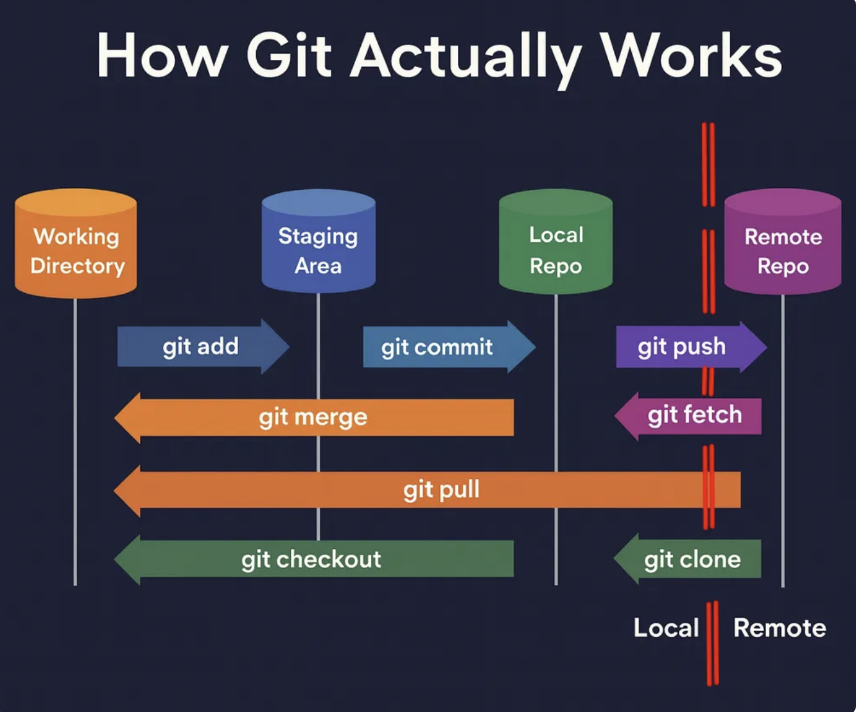

# LABORATORIO 1: REPOSITORIO EN GITHUB

## Índice
- [1. Git y GitHub](#1-git-y-github)
- [2. Crear o clonar un repositorio](#2-crear-o-clonar-un-repositorio)
- [3. Flujo básico](#3-flujo-básico)
- [4. Ramas](#4-ramas)
- [5. Pull Request](#5-pull-request)
- [6. Markdown](#7-markdown)
- [7. Estructura del proyecto](#9-estructura-del-proyecto)
- [8. Flujo recomendado del equipo](#10-flujo-recomendado-del-equipo)
- [9. Comandos rápidos](#11-comandos-rápidos)

---

# 1. Git y GitHub
Para gestionar proyectos de desarrollo y documentación técnica, es fundamental diferenciar Git y Github, dos herramientas complementarias pero con funciones distintas 

## 🛠️ Git
Sistema de control de versiones que permite registrar y recuperar cambios. Se ejecuta de manera local en el equipo del desarrollador y se encarga de administrar el historial de modificaciones de los archivos del proyecto.

**Funciones principales:**
* **Registro de cambios:** Guarda instantáneas (*commits*) del proyecto a lo largo del tiempo, permitiendo auditar qué se modificó, cuándo y por quién.
* **Gestión de ramas (*Branching*):** Permite aislar ideas, probar funcionalidades o corregir errores en líneas de desarrollo paralelas sin alterar la versión principal.
* **Fusión (*Merging*):** Integra de forma estructurada los cambios generados en distintas ramas de trabajo.
* **Reversión de estado:** Permite regresar el proyecto a cualquier punto previo del historial en caso de fallos.
* **Trabajo sin conexión (*Offline*):** Funciona al 100% en el almacenamiento local sin depender de acceso a Internet.

## ☁️ GitHub
Plataforma para almacenar y compartir repositorios Git de forma remota. Ofrece una interfaz gráfica y servicios adicionales diseñados para alojar proyectos en la red y facilitar la colaboración entre equipos de trabajo

**Funciones principales:**
* **Repositorios remotos:** Mantiene una copia centralizada del proyecto disponible en la red para que cualquier colaborador pueda sincronizar sus cambios.
* **Revisión de código (*Pull Requests*):** Permite proponer cambios, comentarlos, revisarlos en equipo y aprobarlos antes de fusionarlos a la rama principal.
* **Gestión de proyectos:** Proporciona herramientas de organización como seguimiento de errores (*Issues*), tableros visuales tipo Kanban y cronogramas.
* **Flujos de automatización:** Integra pruebas automáticas e integración continua a través de herramientas como *GitHub Actions*.
* **Control de accesos:** Administra permisos de lectura, escritura y roles de seguridad para los integrantes del equipo.

**En resumen:**
```text
Git → trabajo local
GitHub → repositorio remoto
```

---

# 2. Arquitecturas de ESTADOS en Git
El motor de Git organiza el ciclo de vida de los archivos atravesando cuatro entornos diferenciados:



1. **Directorio de Trabajo (Woring Directoy):** Espacio local donde se crean, editan o eliminan archivos físicamente.
2. **Área de Preparación (Staging Area/Index):** Zona intermedia donde se agrupan únicamente las modificaciones que formarán parte del próximo registro.
3. **Repositorio Local (Local Repository):** Base de datos almacenada en la carpeta oculta .git de tu computadora, conteniendo el historial completo de commits.
4. **Repositorio Remoto (Remote Repository):** Copia del proyecto alojada en la nube (GitHub) accesible para el equipo.

# 3. Flujo básico y Comandos
El flujo fundamental de trabajo en Git está diseñado para gestionar, registrar y sincronizar de manera ordenada los cambios realizados en el proyecto:

* **`git status`**: Muestra el estado actual de los archivos dentro del repositorio. Identifica qué elementos se han editado, cuáles están listos en el área de preparación (*staging area*) y cuáles aún no son rastreados (*untracked*).
* **`git add .`**: Traslada **todos** los archivos modificados o creados en el directorio de trabajo hacia el área de preparación, dejándolos seleccionados para el próximo registro.
* **`git commit -m "mensaje"`**: Representa la confirmación de guardado dentro del repositorio local. Congela una captura instantánea (*snapshot*) de los cambios con un mensaje explicativo sobre lo realizado.
* **`git push`**: Envía los *commits* confirmados desde el entorno local hacia el servidor de GitHub, transfiriendo las actualizaciones a la nube.
* **`git pull`**: Descarga e integra en tu computadora las modificaciones más recientes alojadas en GitHub, sincronizando tu trabajo local con lo subido por el equipo.

## SECUENCIA LÓGICO DE DESARROLLO:**
`Modificar archivos` → `git status` → `git add .` → `git commit` → `git push` → `GitHub`

```text
Modificar archivos
       ↓
   git status
       ↓
    git add .
       ↓
   git commit
       ↓
    git push
       ↓
     GitHub
```
---

## Detalles útiles y herramientas de inspección

### Diagnóstico del estado (`git status`)

Permite confirmar el estado exacto del proyecto antes y después de seleccionar los archivos a guardar. Se recomienda su uso constante dentro del flujo de trabajo:

```bash
git status    # Muestra el eporte completo de los archivos modificados
git status -s # Muestra el estado en formato corto y compacto 
```
Un flujo habitual de guardado local se ejecuta de la siguiente manera:

## Agregar cambios

```bash
git status
git add .
git commit -m "docs: Descripción del cambio"
```

### Inspección del historial ('git log')

El comando `git log` permite revisar la cronología de cambios confirmados

```bash
git log                                     # Historial detallado de confirmaciones
git log --oneline                           # Lista compacta mostrando una línea por commit
git log --oneline --graph --decorate --all  # Renderiza una representación gráfica del árbol de cambios
```

# 4. Ramas

Las ramas permiten trabajar sin modificar directamente `main`.

## Crear y cambiar de rama

```bash
git switch -c feature/nombre
```

Ejemplos:

```text
feature/readme
feature/documentacion
feature/prototipo
```

## Cambiar de rama

```bash
git switch main
```

## Ver ramas

```bash
git branch
```

---

# 5. Pull Request

Un Pull Request permite revisar los cambios antes de incorporarlos a `main`.

## Flujo

```text
Crear rama
    ↓
Trabajar
    ↓
Commit
    ↓
Push
    ↓
Pull Request
    ↓
Revisión
    ↓
Merge
    ↓
main

---

# 7. Markdown

Markdown permite dar formato a archivos `.md`.

## Títulos

```markdown
# Título principal
## Subtítulo
### Subtítulo secundario
```

## Texto

```markdown
**Negrita**
*Cursiva*
```

## Listas

```markdown
- Elemento 1
- Elemento 2
- Elemento 3
```

## Lista numerada

```markdown
1. Primer elemento
2. Segundo elemento
3. Tercer elemento
```

## Lista de tareas

```markdown
- [ ] Pendiente
- [x] Completado
```

## Enlaces

```markdown
[GitHub](https://github.com)
```

## Código

Código corto:

```markdown
`git status`
```

Bloque:

````markdown
```bash
git status
git add .
git commit -m "Update"
git push
```
````

## Tabla

```markdown
| Integrante | Rol | Estado |
|------------|-----|--------|
| Persona 1 | Diseño |  |
| Persona 2 | Código |  |
```

Usar:

```markdown

```

## Imagen directamente desde GitHub

En `README.md`:

1. Presionar **Edit **.
2. Arrastrar la imagen al editor.
3. GitHub generará el enlace.
4. Hacer **Commit changes**.

---

# 9. Estructura del proyecto

Una estructura simple y ordenada:

```text
proyecto/
├── README.md
├── docs/
├── images/
├── src/
├── data/
└── .gitignore
```

## README.md

Debe contener, de forma resumida:

- Nombre del proyecto.
- Descripción.
- Objetivos.
- Metodología.
- Resultados.
- Imágenes.
- Referencias.

---

# 8. Flujo recomendado del equipo

## Antes de trabajar

Actualizar `main`:

```bash
git switch main
git pull
```

## Crear una rama

```bash
git switch -c feature/nombre
```

## Trabajar y guardar cambios

```bash
git status
git add .
git commit -m "Descripción del cambio"
git push -u origin feature/nombre
```

## Integrar cambios

Crear un **Pull Request** → revisar → aprobar → **Merge**.

---

# 9. Comandos rápidos

| Acción | Comando |
|---|---|
| Ver estado | `git status` |
| Agregar todo | `git add .` |
| Commit | `git commit -m "mensaje"` |
| Subir cambios | `git push` |
| Descargar cambios | `git pull` |
| Clonar | `git clone URL` |
| Ver ramas | `git branch` |
| Crear rama | `git switch -c nombre` |
| Cambiar rama | `git switch nombre` |
| Ver historial | `git log --oneline` |
