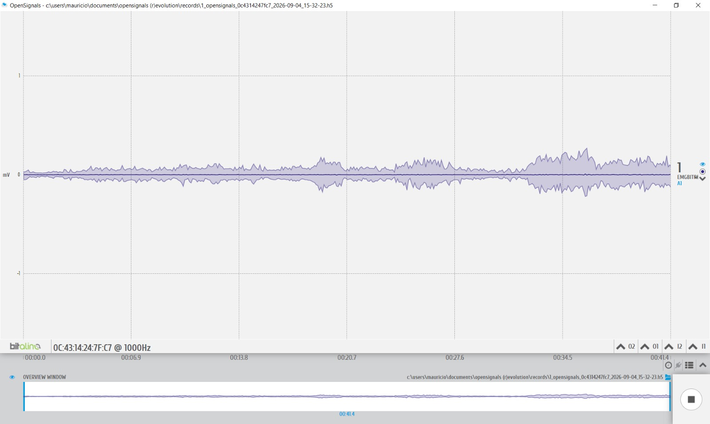
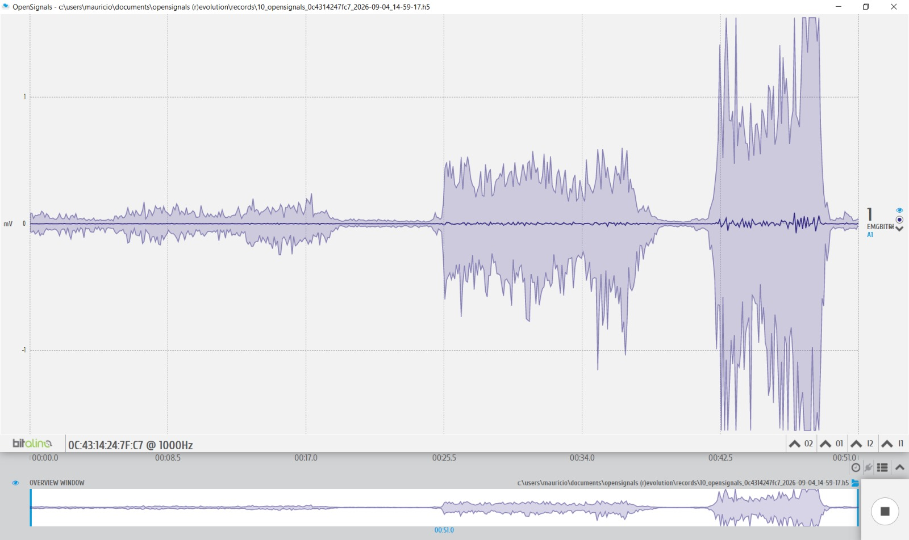

# LABORATORIO 4: USO DE BITALINO PARA ECG

## Índice

1. [Objetivos](#objetivos)
2. [Materiales y equipos](#materiales-y-equipos)
3. [Resultados](#resultados)
   - 3.1 [Conexión usada](#conexión-usada)
   - 3.2 [Video de la señal](#video-de-la-señal)
   - 3.3 [Ploteo de la señal en OpenSignal](#ploteo-de-la-señal-en-opensignal)
   - 3.4 [Archivos](#archivos)
   - 3.5 [Ploteo de la señal en Python](#ploteo-de-la-señal-en-python)
4. [Preguntas de la sesion](#preguntas-de-la-sesion)

## Objetivos

- Adquirir señales electrocardiográficas (ECG) en tiempo real utilizando BITalino y OpenSignals.
- Probar diferentes posiciones de los electrodos para las derivaciones I, II y III de Einthoven.
- Comparar cómo cambia la señal ECG según la derivación y la ubicación de los electrodos.
- Relacionar las partes principales de la señal ECG con la actividad eléctrica del corazón.

Se realizaron adquisiciones en:

- **Bíceps braquial**
- **Abductor pollicis brevis (pulgar)**
- **Trapecio superior**
- **Cigomático mayor**

## Materiales y equipos
- BITalino (r)evolution Core BT.
- Sensor de electrocardiografía (ECG).
- Tres electrodos desechables autoadhesivos de Ag/AgCl con gel.
- OpenSignals (r)evolution.
- Adaptador Bluetooth.

## Resultados

## PRUEBA 1: Derivación I en clavículas y cresta ilíaca

### Conexión utilizada
En esta prueba se utilizó la derivación I de Einthoven. El electrodo positivo, conectado al cable rojo (IN+), se colocó sobre la clavícula izquierda. El electrodo negativo, conectado al cable negro (IN-), se ubicó sobre la clavícula derecha. El electrodo de referencia, conectado al cable blanco (REF), se colocó en la cresta ilíaca.

#### A. Línea basal inicial
El participante permaneció en reposo durante 30 segundos, respirando normalmente y evitando movimientos. Esta parte permitió registrar una señal basal con el menor ruido posible.

  

#### B. Ciclo respiratorio
Se realizaron tres ciclos de inhalación, apnea, exhalación y apnea. Cada una de estas etapas se mantuvo durante cinco segundos. El objetivo fue observar si la respiración producía variaciones en la señal ECG.

https://github.com/user-attachments/assets/4eda0194-80f1-49db-bfdd-0faf6e99cd4c

#### C. Actividad física
En la última fase, el participante intentó flexionar el codo mientras otro integrante aplicaba una fuerza en sentido contrario sobre el antebrazo. Esto permitió generar una contracción más intensa del bíceps sin necesidad de completar totalmente el movimiento. Se realizaron tres intentos con un minuto de descanso entre ellos para reducir la fatiga muscular.

https://github.com/user-attachments/assets/a84982fc-8676-46ad-9ece-67371b3894ec

#### D. Inhalación prolongada y apnea
Luego de una tercera línea basal de 30 segundos, el participante realizó una inhalación prolongada de aproximadamente 10 segundos y mantuvo la respiración durante aproximadamente 10 segundos

https://github.com/user-attachments/assets/a84982fc-8676-46ad-9ece-67371b3894ec

### Video de la señal 

#### A. Línea basal inicial

#### B. Ciclo respiratorio

#### C. Actividad física

#### D. Inhalación prolongada y apnea

### Ploteo de la señal en OpenSignal 

  

### Archivos
Archivos

### Ploteo de la señal en Python
Ploteo de la señal en Python

## PRUEBA 2: Derivación I en muñecas y cresta ilíaca

### Conexión utilizada

#### A. Línea basal inicial

#### B. Ciclo respiratorio

#### C. Actividad física

#### D. Inhalación prolongada y apnea

### Video de la señal 

#### A. Línea basal inicial

#### B. Ciclo respiratorio

#### C. Actividad física

#### D. Inhalación prolongada y apnea

### Ploteo de la señal en OpenSignal 

  

### Archivos
Archivos

### Ploteo de la señal en Python
Ploteo de la señal en Python

## PRUEBA 3: Derivación I en el pecho

### Conexión utilizada

#### A. Línea basal inicial

#### B. Ciclo respiratorio

#### C. Actividad física

#### D. Inhalación prolongada y apnea

### Video de la señal 

#### A. Línea basal inicial

#### B. Ciclo respiratorio

#### C. Actividad física

#### D. Inhalación prolongada y apnea

### Ploteo de la señal en OpenSignal 

  

### Archivos
Archivos

### Ploteo de la señal en Python
Ploteo de la señal en Python

## PRUEBA 4: Derivación II

### Conexión utilizada

#### A. Línea basal inicial

#### B. Ciclo respiratorio

#### C. Actividad física

#### D. Inhalación prolongada y apnea

### Video de la señal 

#### A. Línea basal inicial

#### B. Ciclo respiratorio

#### C. Actividad física

#### D. Inhalación prolongada y apnea

### Ploteo de la señal en OpenSignal 

  

### Archivos
Archivos

### Ploteo de la señal en Python
Ploteo de la señal en Python

## PRUEBA 5: Derivación III

### Conexión utilizada

#### A. Línea basal inicial

#### B. Ciclo respiratorio

#### C. Actividad física

#### D. Inhalación prolongada y apnea

### Video de la señal 

#### A. Línea basal inicial

#### B. Ciclo respiratorio

#### C. Actividad física

#### D. Inhalación prolongada y apnea

### Ploteo de la señal en OpenSignal 

  

### Archivos
Archivos

### Ploteo de la señal en Python
Ploteo de la señal en Python

## Preguntas de la sesión
   - **¿Cuáles son las frecuencias significativas para las adquisiciones de EMG?¿Son las mismas en todas las zonas del cuerpo, como por ejemplo en la zona facial?**

   La energía de la señal EMG de superficie se distribuye entre 10Hz y 500Hz, concentrando su mayor potencia en la banda de 20Hz y 150Hz. Estas frecuencias no son exactamente las mismas para todas las zonas del cuerpo. En el caso de los músculos faciales, por ejemplo, estos poseen unidades motoras más pequeñas y tasas de disparo más elevadas para lograr movimientos finos, desplazado su espectro hacia frecuencias más altas en comparación con los grandes músculos de las extremidades

   - **¿Qué tipo de filtro es esencial al trabajar con señales de EMG?¿Por qué es necesario aplicar dicho filtro?**

   El filtro esencial es el Filtro Pasa-Banda (10Hz - 500Hz), debido a que las frecuencias inferiores a 10-20Hz corresponden a artefactos de movimiento y fluctuaciones de la línea base, mientras que las frecuencias superiores a 500Hz corresponden a ruido electrónico o térmico. Por otro lado, tambien se uso mucho el Filtro Notch o Muesca (50Hz o 60Hz), el cual elimina el zumbido acoplado por la red eléctrica del entorno.

   - **¿Cómo varía la amplitud en cada contracción muscular?¿Existe alguna diferencia según la ubicación en el cuerpo?**

   La amplitud aumenta directamente con la intensidad de la fuerza aplicada. En reposo se observan valores entre 5uV y 50uV, mientras que en una contracción máxima voluntaria la amplitud aumenta debido al mayor reclutamiento de unidades motoras. En cuanto a si existe alguna diferencia según la ubicación el cuerpo, sí existe una diferencia. Músculos con mayor volument generan potenciales de acción más elevados. Asimismo, factores como el grosor del tejido adiposo sudcutáneo y la impedancia cutánea atenúan la señal de forma distinta en cada parte del cuerpo.

   - **Muestre una captura de pantalla de una parte relevante de los datos de electromiografía (EMG) obtenidos durante el experimento propuesto en la Sección D, correspondientes al músculo facial de interés. ¿Coincide esta señal con lo que esperaba?¿Por qué?¿Qué emoción y acción realizó para activar el músculo?¿Qué músculo activó?**
  
   

     
   

   La señal obtenida coincidió con lo esperado, ya que durante la sonrisa se observó un aumento de la actividad EMG en comparación con el reposo facial. La emoción representada fue la felicidad y la acción realizada consistió en sonreír, elevando y retrayendo las comisuras de los labios (esquinas de la boca). Este movimiento produjo principalmente la activación del músculo cigomático mayor.
  
   La señal no fue completamente uniforme durante las repeticiones, lo cual era esperable porque la intensidad y la duración de cada sonrisa no fueron exactamente iguales. Además, los movimientos de otros músculos faciales o de la mandíbula pudieron influir en el registro.

   - **Según su criterio, ¿equivale la amplitud de la EMG a la cantidad de fuerza generada por el músculo?**

   La amplitud de la señal EMG no equivale directamente a la fuerza producida por el músculo, aunque ambas variables se encuentran relacionadas. Al aumentar el esfuerzo muscular, generalmente se recluta una mayor cantidad de unidades motoras y la amplitud de la señal tiende a incrementarse. Esto se pudo notar al comparar las fases de reposo, movimiento leve y contracción máxima.

   Sin embargo, la amplitud también depende de otros factores, como la ubicación de los electrodos, el tejido entre el músculo y la piel, el movimiento durante la medición, la fatiga y la participación de otros músculos. Por ello, una señal con mayor amplitud puede indicar una mayor activación eléctrica, pero no permite conocer directamente la fuerza generada sin realizar un procesamiento adicional y compararla con una medición de fuerza.
