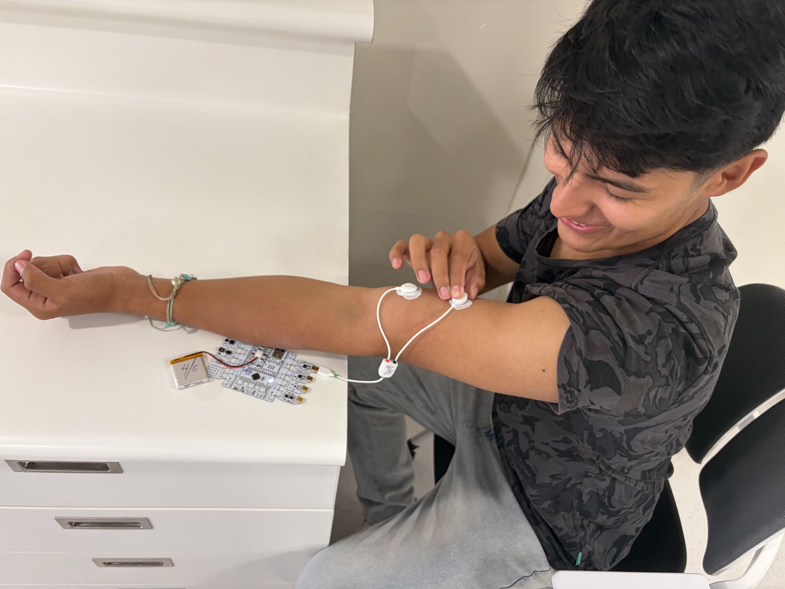
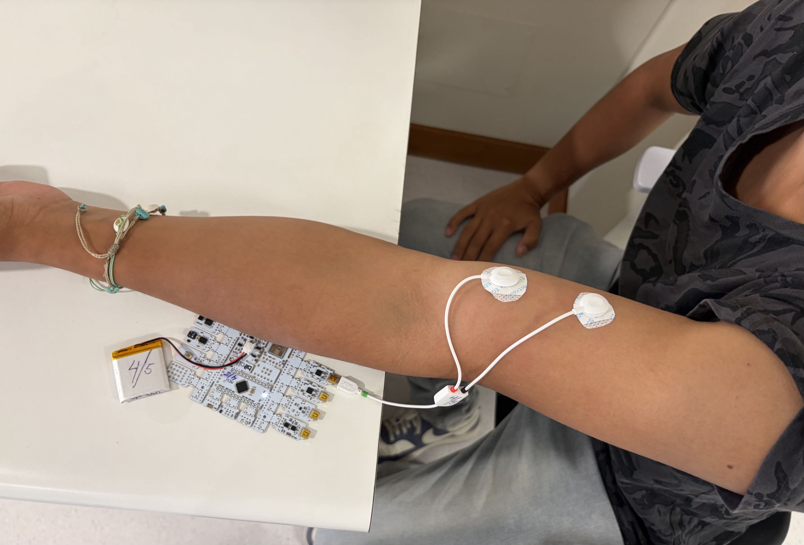
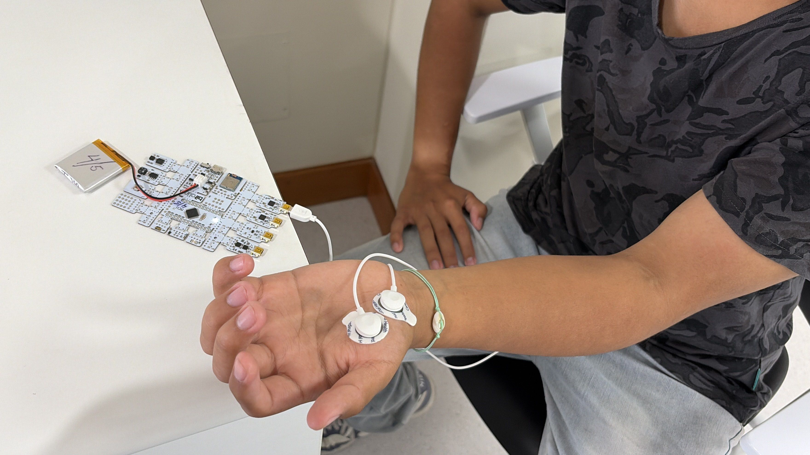
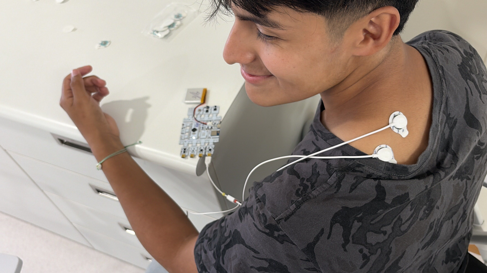
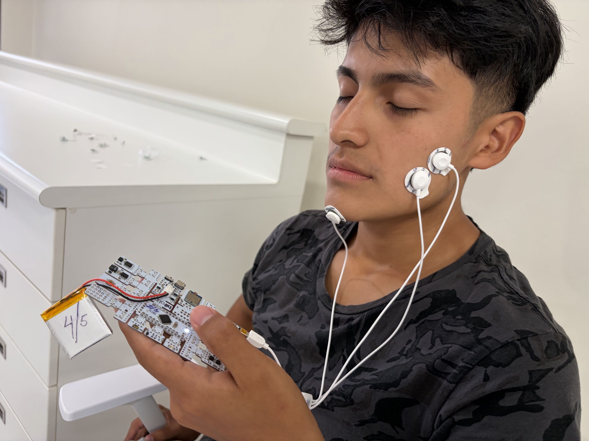

# LABORATORIO 3: USO DE BITALINO PARA EMG y ECG

## Índice

1. [Objetivos](#objetivos)
2. [Materiales y equipos](#materiales-y-equipos)
3. [Resultados](#resultados)
   - 3.1 [Conexión usada](#conexión-usada)
   - 3.2 [Video de la señal](#video-de-la-señal)
   - 3.3 [Ploteo de la señal en OpenSignal](#ploteo-de-la-señal-en-opensignal)
   - 3.4 [Archivos](#archivos)
   - 3.5 [Ploteo de la señal en Python](#ploteo-de-la-señal-en-python)
4. [Preguntas de la sesion](#preguntas-de-la-sesion)

## Objetivos
Objetivos

---

## Materiales y equipos
Materiales

---

## Resultados

## PRUEBA 1: Bíceps braquial

### Conexión utilizada
En esta primera prueba se evaluó la actividad eléctrica del bíceps braquial. Los dos electrodos de medición se colocaron sobre el músculo y siguiendo aproximadamente la dirección de sus fibras. El electrodo de referencia se ubicó en una zona cercana con menor actividad muscular. Después de verificar que los electrodos estuvieran bien adheridos, se inició la adquisición en OpenSignals.

  

#### A. Fase de reposo
Durante esta fase, el participante mantuvo el brazo relajado por aproximadamente 30 segundos. Se procuró evitar movimientos del brazo y del resto del cuerpo para no introducir alteraciones innecesarias en el registro. En esta condición se esperaba observar una señal de menor amplitud, ya que el bíceps no estaba realizando una contracción voluntaria.

  

#### B. Fase de movimiento leve
El participante realizó lentamente una flexión del codo para activar el bíceps. El movimiento se repitió tres veces de manera gradual, dejando un periodo de descanso entre cada intento. A diferencia de la fase de reposo, se esperaba observar un aumento de la actividad registrada durante cada flexión.

https://github.com/user-attachments/assets/4eda0194-80f1-49db-bfdd-0faf6e99cd4c

#### C. Fase de fuerza máxima
En la última fase, el participante intentó flexionar el codo mientras otro integrante aplicaba una fuerza en sentido contrario sobre el antebrazo. Esto permitió generar una contracción más intensa del bíceps sin necesidad de completar totalmente el movimiento. Se realizaron tres intentos con un minuto de descanso entre ellos para reducir la fatiga muscular.

https://github.com/user-attachments/assets/a84982fc-8676-46ad-9ece-67371b3894ec

### Video de la señal 
 faltaaaaa !!

### Ploteo de la señal en OpenSignal 
Ploteo de la señal

### Archivos
Archivos

### Ploteo de la señal en Python
Ploteo de la señal en Python

## PRUEBA 2: Abductor corto del pulgar

### Conexión utilizada 
En esta prueba se evaluó el abductor corto del pulgar, ubicado en la eminencia tenar, en la base del pulgar. Los electrodos de medición se colocaron sobre esta región siguiendo aproximadamente la orientación de las fibras musculares. Una vez comprobada la conexión, se procedió a registrar las tres fases en OpenSignals.

  

#### A. Fase de reposo
El participante mantuvo la mano y el pulgar relajados durante aproximadamente 30 segundos. Se evitó mover los dedos para mantener una señal basal lo más estable posible. Al no existir una activación voluntaria, se esperaba registrar una actividad menor que en las siguientes fases.

https://github.com/user-attachments/assets/9aee90f9-23f4-4b2f-ba49-3ba6cab8b725

#### B. Fase de movimiento leve
Se realizaron tres abducciones lentas del pulgar, separándolo de la palma de forma controlada. Entre cada repetición se dejó un periodo de descanso. Durante el movimiento se esperaba distinguir un incremento de la señal debido a la activación del músculo.

https://github.com/user-attachments/assets/4f0fa4fb-02ce-4fe8-8007-3374a7fb9a7a

#### C. Fase de fuerza máxima
El participante intentó separar el pulgar mientras otro integrante aplicaba una resistencia en sentido contrario. De esta manera, el músculo debía realizar un esfuerzo mayor para mantener el movimiento. Se hicieron tres intentos con un minuto de descanso entre cada uno.

https://github.com/user-attachments/assets/d413864e-2a4d-443d-bb20-e2cf96fe21a0

### Video de la señal 
faltaaa

### Ploteo de la señal en OpenSignal 
Ploteo de la señal

### Archivos
Archivos

### Ploteo de la señal en Python
Ploteo de la señal en Python

## PRUEBA 3: Trapecio superior

### Conexión utilizada
En la tercera prueba se registró la actividad del trapecio superior, localizado entre la parte posterior del cuello y el hombro. Los electrodos de medición se colocaron sobre el músculo siguiendo aproximadamente la dirección de sus fibras. Luego se verificó la visualización de la señal en OpenSignals.

  

#### A. Fase de reposo
El participante permaneció sentado con los hombros relajados durante aproximadamente 30 segundos. Se trató de mantener una postura estable y evitar movimientos del cuello, debido a que estos podían afectar el registro.

https://github.com/user-attachments/assets/d96e72d4-f9db-42f0-9a7b-9f81c27fc2c9

#### B. Fase de movimiento leve
El participante elevó lentamente el hombro y luego regresó a la posición inicial. Este movimiento se realizó tres veces, dejando un periodo de reposo entre cada repetición. Se esperaba observar un aumento de la actividad del trapecio durante la elevación.

https://github.com/user-attachments/assets/2f7ed252-6458-4b68-b16c-1025247c2b6a

#### C. Fase de fuerza máxima
El participante intentó elevar el hombro mientras otro integrante aplicaba una fuerza hacia abajo para oponerse al movimiento. Se realizaron tres intentos, separados por un minuto de descanso. Esta condición buscó producir una contracción mayor que la obtenida durante el movimiento leve.

https://github.com/user-attachments/assets/6cf111d2-a12d-4699-a195-e8f97db299f8

### Video de la señal 
faltaaa

### Ploteo de la señal en OpenSignal 
Ploteo de la señal

### Archivos
Archivos

### Ploteo de la señal en Python
Ploteo de la señal en Python

## PRUEBA 4: Cigomático mayor

### Conexión utilizada
Finalmente, se evaluó el cigomático mayor, músculo facial que participa principalmente en la sonrisa. Los electrodos de medición se colocaron sobre la mejilla, siguiendo aproximadamente la dirección del músculo. El electrodo de referencia se ubicó detrás de la oreja.

  

)

#### A. Fase de reposo
El participante mantuvo el rostro relajado durante aproximadamente 30 segundos, evitando hablar, sonreír o mover la mandíbula. Esto permitió obtener un registro basal de la actividad muscular facial.

https://github.com/user-attachments/assets/6df24a53-f25b-4465-992d-5438b2ffa2e6

#### B. Fase de movimiento leve
El participante realizó una sonrisa leve y controlada en tres ocasiones, regresando a una expresión neutral después de cada repetición. Se esperaba observar un aumento de la señal durante la elevación de las comisuras de los labios.

https://github.com/user-attachments/assets/9a03e7c9-5a06-4239-92db-dd41f9cfad0d

#### C. Fase de fuerza máxima
En esta fase, el participante realizó una sonrisa de mayor intensidad para generar una contracción más fuerte del cigomático mayor. Se realizaron tres intentos con periodos de descanso entre ellos. En este caso no se aplicó resistencia externa, debido a que se trataba de un músculo facial.

https://github.com/user-attachments/assets/751460bc-c6e1-45d2-9bf1-a1ee5c1a3b18

### Video de la señal 
faltaa

### Ploteo de la señal en OpenSignal 
Ploteo de la señal

### Archivos
Archivos

### Ploteo de la señal en Python
Ploteo de la señal en Python

## Preguntas de la sesión
   - **¿Cuáles son las frecuencias significativas para las adquisiciones de EMG?¿Son las mismas en todas las zonas del cuerpo, como por ejemplo en la zona facial?**

   La energía de la señal EMG de superficie se distribuye entre 10Hz y 500Hz, concentrando su mayor potencia en la banda de 20Hz y 150Hz. Estas frecuencias no son exactamente las mismas para todas las zonas del cuerpo. En el caso de los músculos faciales, por ejemplo, estos poseen unidades motoras más pequeñas y tasas de disparo más elevadas para lograr movimientos finos, desplazado su espectro hacia frecuencias más altas en comparación con los grandes músculos de las extremidades

   - **¿Qué tipo de filtro es esencial al trabajar con señales de EMG?¿Por qué es necesario aplicar dicho filtro?**

   El filtro esencial es el Filtro Pasa-Banda (10Hz - 500Hz), debido a que las frecuencias inferiores a 10-20Hz corresponden a artefactos de movimiento y fluctuaciones de la línea base, mientras que las frecuencias superiores a 500Hz corresponden a ruido electrónico o térmico. Por otro lado, tambien se uso mucho el Filtro Notch o Muesca (50Hz o 60Hz), el cual elimina el zumbido acoplado por la red eléctrica del entorno.

   - **¿Cómo varía la amplitud en cada contracción muscular?¿Existe alguna diferencia según la ubicación en el cuerpo?**

   La amplitud aumenta directamente con la intensidad de la fuerza aplicada. En reposo se observan valores entre 5uV y 50uV, mientras que en una contracción máxima voluntaria la amplitud aumenta debido al mayor reclutamiento de unidades motoras. En cuanto a si existe alguna diferencia según la ubicación el cuerpo, sí existe una diferencia. Músculos con mayor volument generan potenciales de acción más elevados. Asimismo, factores como el grosor del tejido adiposo sudcutáneo y la impedancia cutánea atenúan la señal de forma distinta en cada parte del cuerpo.

   - **Muestre una captura de pantalla de una parte relevante de los datos de electromiografía (EMG) obtenidos durante el experimento propuesto en la Sección D, correspondientes al músculo facial de interés. ¿Coincide esta señal con lo que esperaba?¿Por qué?¿Qué emoción y acción realizó para activar el músculo?¿Qué músculo activó?**
   - **Según su criterio, ¿equivale la amplitud de la EMG a la cantidad de fuerza generada por el músculo?**
