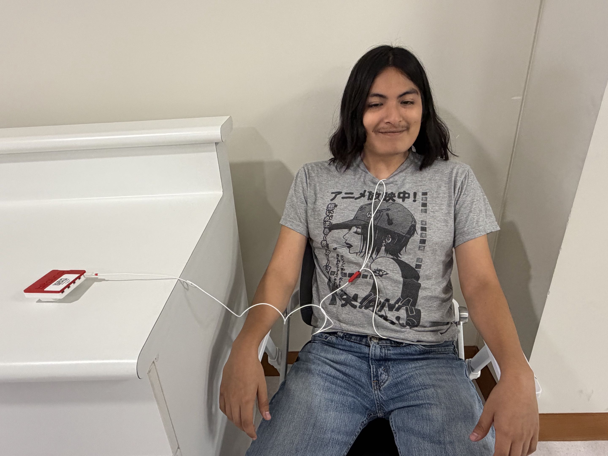
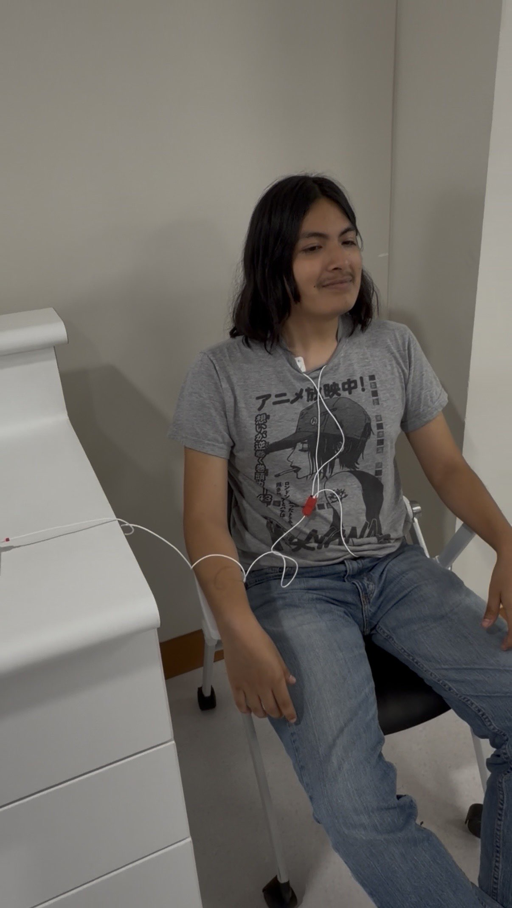
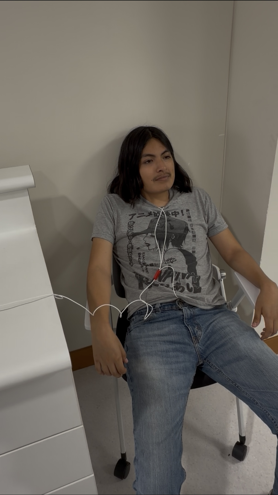
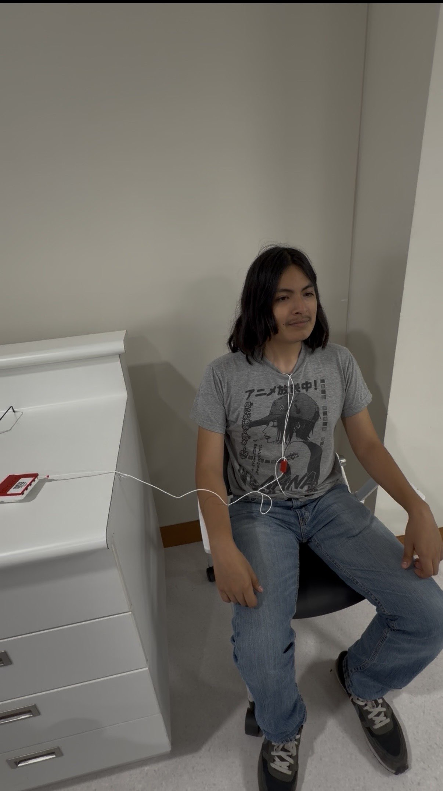
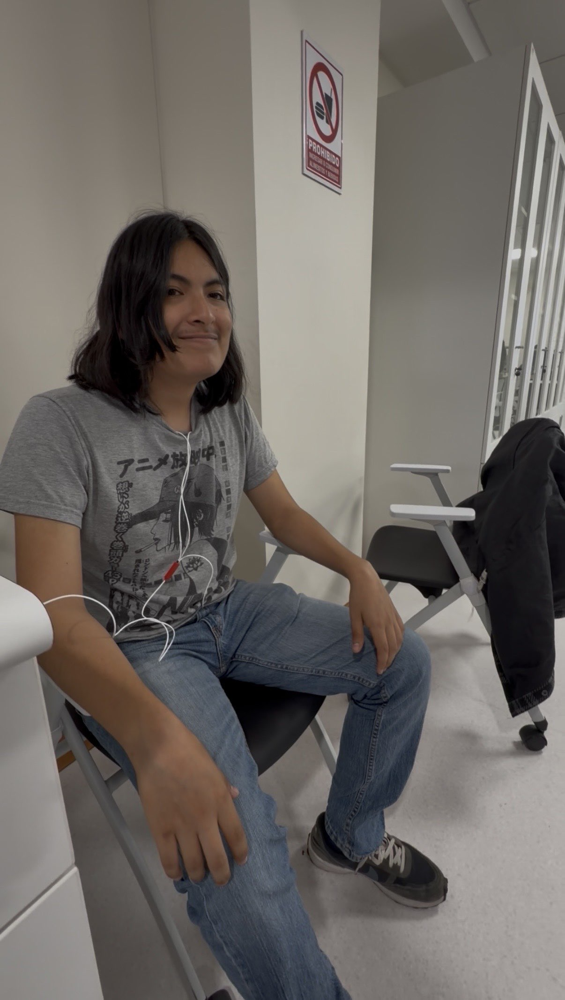
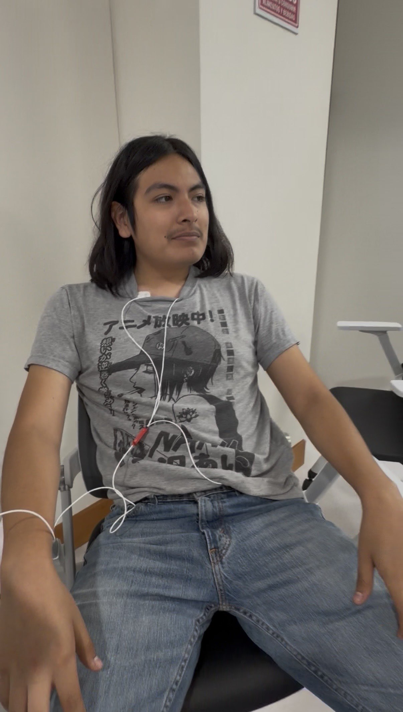

# LABORATORIO 4: USO DE BITALINO PARA ECG

## Índice

1. [Objetivos](#objetivos)
2. [Materiales y equipos](#materiales-y-equipos)
3. [Resultados](#resultados)
   - 3.1 [Conexión usada](#conexión-usada)
   - 3.2 [Video de la señal](#video-de-la-señal)
   - 3.3 [Ploteo de la señal en OpenSignal](#ploteo-de-la-señal-en-opensignal)
   - 3.4 [Archivos](#archivos)
   - 3.5 [Ploteo de la señal en Python](#ploteo-de-la-señal-en-python)
4. [Preguntas de la sesion](#preguntas-de-la-sesion)

## Objetivos

- Adquirir señales electrocardiográficas (ECG) en tiempo real utilizando BITalino y OpenSignals.
- Registrar la señal ECG mediante las derivaciones I, II y III de Einthoven.
- Comparar los cambios de la señal ECG entre las tres derivaciones.
- Evaluar la señal ECG durante el reposo, la hipoventilación, la hiperventilación y la actividad física.
- Relacionar los componentes principales de la señal ECG con la actividad eléctrica del corazón.

Se realizaron adquisiciones en:
- Derivación I de Einthoven.
- Derivación II de Einthoven.
- Derivación III de Einthoven.

Las condiciones evaluadas fueron:
- Reposo.
- Hipoventilación.
- Hiperventilación.
- Actividad física.

## Materiales y equipos
- BITalino (r)evolution Core BT.
- Sensor de electrocardiografía (ECG).
- Tres electrodos desechables autoadhesivos de Ag/AgCl con gel.
- OpenSignals (r)evolution.
- Adaptador Bluetooth.

## Procedimiento general
El sensor ECG se conectó a uno de los canales analógicos disponibles del BITalino. Después, los tres cables del sensor se conectaron a sus respectivos electrodos: entrada positiva (IN+), entrada negativa (IN−) y referencia (REF). Una vez verificada la conexión, se inició el registro en OpenSignals.

Se realizaron adquisiciones utilizando las derivaciones I, II y III de Einthoven. Para cada derivación se evaluaron cuatro condiciones:
- Reposo.
- Hipoventilación.
- Hiperventilación.
- Actividad física.

Durante el registro en reposo, el participante permaneció quieto y respiró con normalidad. En las pruebas respiratorias se modificó voluntariamente el patrón de respiración para generar las condiciones de hipoventilación e hiperventilación. Para la actividad física, el participante realizó el ejercicio establecido por el grupo y se registró la señal ECG correspondiente.
Finalmente, se detuvo cada adquisición y los registros obtenidos se guardaron en formato H5 y TXT para su posterior análisis.

## Resultados

## PRUEBA 1: Derivación I

### Conexión utilizada (NO ESTOY SEGURO)
En esta prueba se utilizó la derivación I de Einthoven. El electrodo positivo, conectado al cable rojo (IN+), se colocó sobre la clavícula izquierda. El electrodo negativo, conectado al cable negro (IN-), se ubicó sobre la clavícula derecha. El electrodo de referencia, conectado al cable blanco (REF), se colocó en la cresta ilíaca. 

  

#### A. Reposo
El participante permaneció quieto y mantuvo una respiración normal durante la adquisición. Se evitó mover los brazos y el resto del cuerpo para reducir los artefactos de movimiento y obtener una señal basal.

https://github.com/user-attachments/assets/7d7d8282-91c8-47d0-ba61-9d6debcc7626

#### B. Hipoventilación
Durante esta prueba, el participante disminuyó voluntariamente su frecuencia respiratoria. La señal ECG se registró durante esta condición para observar si el cambio en el patrón respiratorio producía variaciones en la señal.

  

#### C. Hiperventilación
Durante esta prueba, el participante aumentó voluntariamente la frecuencia y profundidad de su respiración. La señal ECG se registró durante esta condición para observar las variaciones producidas por una respiración más rápida y profunda.

https://github.com/user-attachments/assets/c32edcd3-f383-4ba3-9b65-f405412b2bfe

#### D. Actividad física
El participante realizó la actividad física establecida por el grupo. La señal ECG se registró para observar los cambios producidos en la frecuencia cardiaca y la presencia de artefactos ocasionados por el movimiento.

### Video de la señal 

#### A. Reposo

#### B. Hipoventilación

#### C. Hiperventilación

#### D. Actividad física

### Ploteo de la señal en OpenSignal 

### Archivos

[ECG en reposo - Derivación I](./Laboratorios/Lab_04/DatosSenalesECG_CSV/ECG_Reposo_I.csv)
[ECG en Hipoventilación - Derivación I](./Laboratorios/Lab_04/DatosSenalesECG_CSV/ECG_Hipoventilacion_I.csv)
[ECG en Hiperventilación - Derivación I](./Laboratorios/Lab_04/DatosSenalesECG_CSV/ECG_Hiperventilacion_I.csv)
[ECG en Actividad física - Derivación I](./Laboratorios/Lab_04/DatosSenalesECG_CSV/ECG_actividadfisica_I.csv)

### Ploteo de la señal en Python
Ploteo de la señal en Python
#### A. Reposo

#### B. Hipoventilación

#### C. Hiperventilación

#### D. Actividad física

## PRUEBA 2: Derivación II

### Conexión utilizada (NO ESTOY SEGURO)

En esta prueba se utilizó la derivación II de Einthoven, la cual registra la diferencia de potencial desde el brazo derecho, correspondiente al polo negativo, hacia la pierna izquierda, correspondiente al polo positivo.

Para obtener esta derivación, el electrodo negativo negro (IN−) se colocó en el lado correspondiente al brazo derecho y el electrodo positivo rojo (IN+) en la posición correspondiente a la pierna izquierda. El electrodo blanco se utilizó como referencia.

  

#### A. Reposo
El participante permaneció quieto y respiró normalmente durante la adquisición. Este registro se utilizó como señal basal de la derivación II.

https://github.com/user-attachments/assets/d8814ab4-fb6f-4e16-b76a-a65e575d9085

#### B. Hipoventilación
El participante disminuyó voluntariamente su frecuencia respiratoria mientras se registraba la señal ECG mediante la derivación II. Se evitó realizar movimientos adicionales para reducir la aparición de artefactos.

  

#### C. Hiperventilación
El participante aumentó voluntariamente la frecuencia y profundidad de la respiración mientras se registraba la señal ECG mediante la derivación II.

https://github.com/user-attachments/assets/4a5d418c-aa11-4dcd-8c74-164994804043

#### D. Actividad física
El participante realizó la actividad física establecida por el grupo y se registró la señal correspondiente a la derivación II. Esta adquisición permitió observar los cambios posteriores al esfuerzo físico.

https://github.com/user-attachments/assets/c2fcb044-5dac-4cd2-b5eb-d6344efd8973

### Video de la señal 

#### A. Reposo

#### B. Hipoventilación

#### C. Hiperventilación

#### D. Actividad física

### Ploteo de la señal en OpenSignal 

### Archivos

[ECG en reposo - Derivación II](./Laboratorios/Lab_04/DatosSenalesECG_CSV/ECG_Reposo_II.csv)
[ECG en Hipoventilación - Derivación II](./Laboratorios/Lab_04/DatosSenalesECG_CSV/ECG_Hipoventilacion_II.csv)
[ECG en Hiperventilación - Derivación II](./Laboratorios/Lab_04/DatosSenalesECG_CSV/ECG_Hiperventilacion_II.csv)
[ECG en Actividad física - Derivación II](./Laboratorios/Lab_04/DatosSenalesECG_CSV/ECG_actividadfisica_II.csv)

### Ploteo de la señal en Python
Ploteo de la señal en Python

#### A. Reposo

#### B. Hipoventilación

#### C. Hiperventilación

#### D. Actividad física

## PRUEBA 3: Derivación III

### Conexión utilizada (NO ESTOY SEGURO)
En esta prueba se utilizó la derivación III de Einthoven, la cual registra la diferencia de potencial desde el brazo izquierdo, correspondiente al polo negativo, hacia la pierna izquierda, correspondiente al polo positivo.

El electrodo negativo negro (IN−) se colocó en la posición correspondiente al brazo izquierdo y el electrodo positivo rojo (IN+) en la posición correspondiente a la pierna izquierda. El electrodo blanco se utilizó como referencia.

  

#### A. Reposo
El participante permaneció quieto y respiró normalmente durante la adquisición. Este registro se utilizó como señal basal de la derivación III.

https://github.com/user-attachments/assets/161a731d-d6a2-48fe-adad-bcf8fa3ecc25

#### B. Hipoventilación
El participante disminuyó voluntariamente su frecuencia respiratoria mientras se registraba la señal ECG mediante la derivación III.

  

#### C. Hiperventilación
El participante aumentó voluntariamente la frecuencia y profundidad de la respiración mientras se registraba la señal ECG mediante la derivación III.

https://github.com/user-attachments/assets/869587b5-dbec-4f50-a69a-dcaad1c3abbf

#### D. Actividad física
El participante realizó la actividad física establecida por el grupo y se registró la señal ECG correspondiente a la derivación III. Durante el análisis se deberá considerar que el movimiento puede introducir artefactos en el registro.

https://github.com/user-attachments/assets/aec6b3a4-caf0-4b57-a255-c6e012211248

### Video de la señal 

#### A. Reposo

#### B. Hipoventilación

#### C. Hiperventilación

#### D. Actividad física

### Ploteo de la señal en OpenSignal 

### Archivos

[ECG en reposo - Derivación III](./Laboratorios/Lab_04/DatosSenalesECG_CSV/ECG_Reposo_III.csv)
[ECG en Hipoventilación - Derivación III](./Laboratorios/Lab_04/DatosSenalesECG_CSV/ECG_Hipoventilacion_III.csv)
[ECG en Hiperventilación - Derivación III](./Laboratorios/Lab_04/DatosSenalesECG_CSV/ECG_Hiperventilacion_III.csv)
[ECG en Actividad física - Derivación III](./Laboratorios/Lab_04/DatosSenalesECG_CSV/ECG_actividadfisica_III.csv)

### Ploteo de la señal en Python
Ploteo de la señal en Python

#### A. Reposo

#### B. Hipoventilación

#### C. Hiperventilación

#### D. Actividad física

## Preguntas de la sesión

   - **¿Cuáles son las fuentes de ruido más comunes que afectan a una señal de ECG?** (will)

   - **¿Por qué el cambio en la posición de los electrodos, entre las derivaciones I, II y III, modifica los componentes de la señal ECG? ¿Cómo cambian estos componentes?** (will)
   

   - **¿Existen diferencias importantes al adquirir la señal ECG en distintas partes del cuerpo, como las muñecas, las clavículas o el pecho? ¿Cuál podría ser la causa? ¿Esperaba observar estos cambios? Muestre un segmento de la señal obtenida en cada ubicación para visualizar las diferencias.**  (will)

   - **Los sistemas cardiaco y respiratorio se encuentran relacionados. ¿Considera que las distintas formas de respiración, como una respiración más rápida o profunda, pueden influir en la señal ECG? Muestre capturas de las señales obtenidas bajo diferentes condiciones respiratorias y describa las variaciones observadas, si las hubiera.** (jairo)

   
   
   - **En la Home-Guide n.º 1 se observó que diferentes niveles de fuerza muscular producían señales con amplitudes distintas. ¿Cómo influye el movimiento en la señal ECG?** (jairo)
  
   El movimiento afecta la señal ECG porque puede hacer que los electrodos se desplacen o cambien su contacto con la piel. Como resultado, aparecen picos o variaciones que no necesariamente corresponden a la actividad del corazón.

   Esto se notó principalmente durante la actividad física, ya que al realizar los burpees se activaron varios músculos y hubo bastante movimiento corporal. Por esa razón, durante el ejercicio fue más difícil reconocer con claridad los componentes del ECG. Para evaluar la frecuencia cardiaca fue más conveniente observar el registro obtenido después del ejercicio, cuando el participante ya estaba quieto, pero su frecuencia cardiaca todavía se encontraba elevada.

   - **Según sus conocimientos, ¿cómo se pueden detectar la bradicardia y la taquicardia en una señal ECG?** (jairo)
  
   Para identificarlas se pueden ubicar los picos R y medir el tiempo entre dos picos consecutivos, conocido como intervalo R-R. Con este intervalo se calcula la frecuencia cardiaca:

   Frecuencia cardiaca (lpm) = 60 / intervalo R-R (s)

   En un adulto en reposo, una frecuencia menor de 60 latidos por minuto se considera bradicardia. En el ECG, los picos R se observan más separados. Por otro lado, una frecuencia mayor de 100 latidos por minuto se considera taquicardia y los picos R aparecen más juntos.

   De todas formas, estos valores deben relacionarse con la condición en la que se realizó la medición. Por ejemplo, después de realizar ejercicio es normal que la frecuencia cardiaca aumente, por lo que no sería correcto concluir que existe una taquicardia anormal solamente por ese registro.

   

